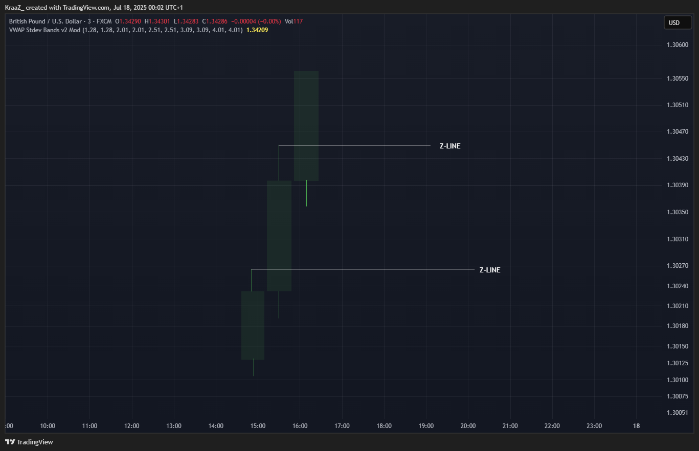
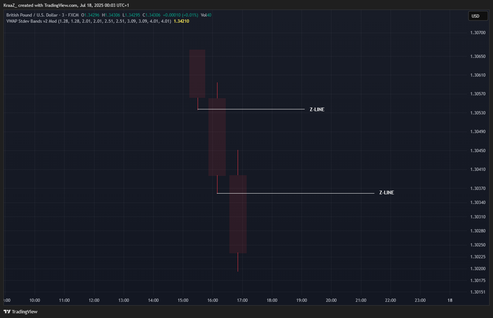
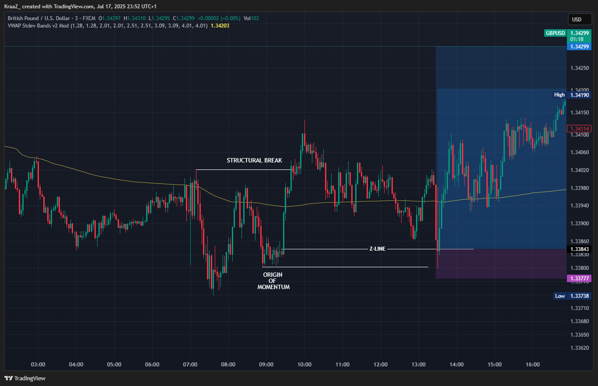
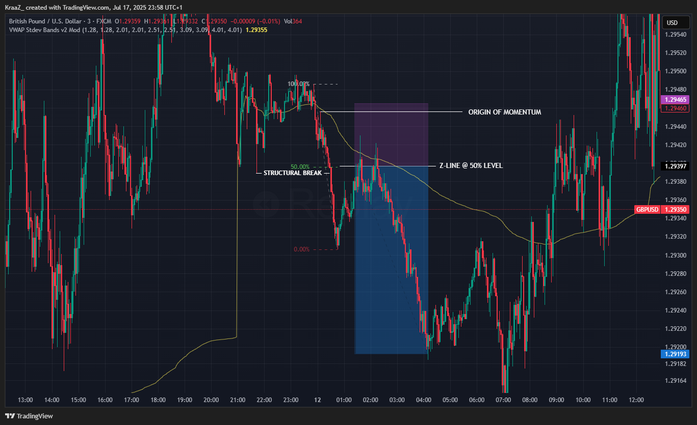

# 📘 Z-Theory Trading Method  
**By Kieron Wiltshire**  
*Inspired by the work of MightyOne. This document is for educational purposes and is not financial advice.*

---

## 📋 Table of Contents

1. [Strategy Overview](#-strategy-overview)
2. [Momentum](#-1-momentum)
3. [Z-Line](#️-2-z-line)
4. [Trading](#-3-trading)
5. [Stop Loss Placement](#️-4-stop-loss-placement)
6. [Additive Position Sizing](#-4-additive-position-sizing-compounding-winners)
7. [Exit Strategy](#️-5-exit-strategy)
8. [Trade Management](#-6-trade-management)
9. [Examples](#-7-examples)
10. [Notes](#-notes)
11. [Final Thoughts](#-final-thoughts)

---

## 🧠 Strategy Overview

This trading plan combines structural price action with aggressive compounding, aiming to capture high R:R trades with minimal initial risk.

### 📃 Requirements

To understand and apply this trading method, you should have:

- A basic understanding of price action (support/resistance, swing highs/lows, candlestick patterns).
- Familiarity with reading candlestick charts on platforms like TradingView or MT4/MT5.
- The ability to identify market structure (trends, consolidations, breakouts).
- Basic risk management knowledge (position sizing, stop loss, risk/reward).

No advanced indicators or complex tools are required—just clean charts and price action reading skills. However, the Volume Weighted Average Price (VWAP) indicator can be useful for determining profit targets and additional entry points.

### 🔷 Core Concepts
- **Momentum**: A candle which breaks the high or low of the previous candle.
- **Z-Line**: A price level where structure breaks and is then retested.
- **Additive Positioning**: Increase size only with unrealized profit.
- **Tight, structure-based stops**: Small losses, large gains.

---

## 🔍 1. Momentum

A **momentum candle** is defined as a candle that closes **above the high** (bullish momentum) or **below the low** (bearish momentum) of the previous candle. This price action signals a clear supply or demand imbalance—buyers or sellers have decisively taken control, pushing price beyond the prior range.

When such a momentum candle forms, it often leaves behind a significant price level at the point where the move originated. This level is known as the **Z-Line**. The Z-Line acts as a structural reference: after the momentum move, price frequently returns to this level to "retest" it. If the level holds, it can provide a high-probability entry point in the direction of the original momentum.

**Summary:**
- Momentum candle = closes beyond previous candle's high/low.
- Indicates strong supply/demand imbalance.
- The origin of the move becomes the Z-Line.
- Price often retests the Z-Line, offering a potential entry.

**Visual Example:**

## 0️⃣ 2. Z-Line

A **Z-Line** is the price level where a structural break occurs and is then retested, as described above. However, when **multiple Z-Lines form in quick succession** (for example, during a strong trend or a series of momentum candles), it becomes less reliable to use the most recent Z-Line for entries. In these cases, it is preferable to use the **50% retracement of the entire move** (or a level even lower, in the case of a bullish move; higher for bearish) as your Z-Line reference. This is because the market may not respect any single Z-Line in a cluster, but is more likely to react at a deeper retracement where trapped traders are forced out and new liquidity is found.

**Key Points:**
- If there is only one clear Z-Line, use that for your retest entry.
- If there are **multiple Z-Lines stacked together**, look for the 50% retracement (midpoint) of the whole move, or a deeper level, as your main Z-Line.
- This approach helps avoid false entries and increases the probability of catching the true continuation after a pullback.

### 📝 Why "Z-Line"?

The term **Z-Line** originates from the visual pattern that often forms during a break and retest setup. When price breaks through a key level and then returns to retest it before continuing in the direction of the break, the resulting price action can resemble the shape of the letter "Z" on the chart. This is where the original name comes from—a **Z-shaped path** created by the break, the pullback, and the continuation.

However, a more fitting interpretation is to think of the Z-Line as the **"Zero Line"**. This is the level where trapped traders—those who entered against the momentum—are forced to exit (or get "zeroed out") when price returns to the origin of the move. The Z-Line thus represents the point of maximum pain for these traders, and is often where new momentum is generated as their positions are closed out.

**In summary:**
- **Z-Line** = Named for the "Z" pattern formed by break and retest.
- **Zero Line** = The level where trapped traders are forced out, resetting the market structure and providing a high-probability entry for the next move.

---

## 🎯 3. Trading

For a **Z-Line** to be considered valid, it is essential that price continues to break the previous high (in an uptrend) or low (in a downtrend) with clear momentum after the retest. This means that the retest of the Z-Line should be followed by a decisive move—another momentum candle that closes beyond the prior high or low. Without this continuation, the Z-Line loses its reliability as a structural reference, and the setup may fail.

**Key Validation Criteria:**
- After price retests the Z-Line, it must break the previous high/low with momentum.
- The break should be clear and decisive (momentum candle, not just a wick).
- If price stalls or fails to break the level, the Z-Line is not confirmed and the trade should be avoided.

This rule helps filter out weak setups and ensures you are only trading in the direction of strong, ongoing momentum.

### 🛎️ Entry Execution at the Z-Line

An entry at the Z-Line can be executed in two main ways:

1. **Limit Order at the Z-Line:**  
   - Place a limit order directly at the Z-Line price level.  
   - This ensures you enter at the optimal price, but there is a risk the order may not be filled if price narrowly misses the level or quickly wicks through.

2. **Market Order as Price Reaches the Z-Line:**  
   - Enter with a market order as price approaches or taps the Z-Line.  
   - This increases the likelihood of getting filled, but Z-Line retests can be volatile, leading to slippage or less favorable entry.

**Tip:**  
Z-Line retests are often sharp and fast, especially during high momentum. If you wait for confirmation (such as a reversal candle or lower timeframe signal), you may miss the move entirely. Consider your execution style and risk tolerance:

- If you want the best price and are willing to risk missing the trade, use a limit order.
- If you prioritize getting into the trade, use a market order as price hits the level, but be prepared for volatility and possible slippage.

**Optional: Wait for Clearer Structure or Multiple Retests**  
You do not have to enter on the very first touch of the Z-Line. In some cases, it is wise to wait for additional confirmation—such as price making a series of higher highs and higher lows (in an uptrend) or lower lows and lower highs (in a downtrend) after the initial Z-Line retest. This can mean waiting for the Z-Line to be tested multiple times and for structure to hold, which increases the probability that the level is significant and that trapped traders are being forced out. This approach may result in a less optimal entry price, but it can filter out false breaks and improve your win rate.

- **Wait for multiple Z-Line retests:** If price returns to the Z-Line several times and holds, this can signal strong support/resistance.
- **Wait for structure to confirm:** Look for the market to make a new high (in an uptrend) or new low (in a downtrend) after the Z-Line retest before entering.

**Advanced:**  
Some traders use a "hybrid" approach—set a limit order at the Z-Line and, if not filled, enter with a market order if price shows a strong reaction at the level, or after multiple retests and clear structure confirmation.

---

## 🛡️ 4. Stop Loss Placement

Always place stops based on **structure invalidation**, not arbitrary distance. A stop loss is where your trade idea is considered wrong and your reasoning for entering the trade is no longer valid.

### Stop Loss Placement Options:

1. **Below/Above the Origin of Momentum (Usually the Broken Swing)**
   - This is the most common and recommended method.
   - The stop should be placed just below (for longs) or above (for shorts) the origin of the momentum move that created the Z-Line, which is often the swing that was broken.
   - Add a small buffer (1–3 pips or half the spread) to avoid being stopped out by noise.

2. **Below/Above the Wick of the Candle That Created the Z-Line**
   - This is an optional, more aggressive approach.
   - Stops here are tighter and can result in higher risk-reward trades, but are riskier and more likely to be hit by volatility.
   - Use only if the signal is very high quality and you are comfortable with the increased risk.

3. **Below/Above a Lower Timeframe Z-Line or Mini-Structure**
   - This is possible if you are trading Z-Lines on higher timeframes and want a tighter stop.
   - However, this is riskier, as lower timeframe structure can break while the higher timeframe Z-Line remains valid.
   - Not generally recommended unless you have significant experience and a clear reason.

📌 *Avoid unnecessarily wide stops. If your stop loss seems large and your risk-reward (RR) is less than 3, it's likely your entry or your stop is incorrect. Do not use arbitrary stops—always base your stop on structure as described above.*

---

## 💰 4. Additive Position Sizing (Compounding Winners)

> **Important:** Only use additive position sizing if you are trading *away from a higher timeframe extreme* and in the direction of the higher timeframe trend. This approach is best suited for trending conditions, not for countertrend or range-bound trades.

> Only add if previous position is in **floating profit** or **break-even**.

### Steps:
1. **Initial Entry** — Small risk (e.g., 0.5–1%).
2. **Add Position** as price moves in your favor.
   - Add once per key structure break or mini-pullback.
   - Maintain stop for all positions based on latest structure.
3. **Do not add if any open position is in loss.**

📌 *Goal: pyramid risk-free positions using only unrealized profit, and only in the direction of the prevailing higher timeframe trend.*

---

## 🏁 5. Exit Strategy

Choose one of the following or combine:

- Predefined **R-multiple target** (e.g., 3R, 5R).
- **Structure-based exit** (next S/R zone).
- **Trailing stop** behind swing lows/highs.
- **Manual exit** after exhaustion candle.
- **VWAP-based exit or re-entry** — The VWAP (Volume Weighted Average Price) can be considered an ideal re-entry or exit point, as it acts like a dynamic support/resistance level.

---

## 🧪 6. Trade Management

- **After Entry**:
  - *Note: Moving stops to breakeven is generally not recommended, as it can result in being stopped out prematurely while the trade idea remains valid (the trade is not invalidated until the Z-Line breaks down). However, if your personal risk tolerance is low, you may choose to move your stop to breakeven when the first R is reached.*
  - Secure partial profits if volatility increases.
  - Let winners run if in strong trend.

- **Additive Rule Reminder**:
  - Never add into a loser.
  - Only risk open profits.

---

## 📈 7. Examples

---

## 🧭 Notes

- Keep charts clean: no indicators except VWAP. Only draw Z-Lines (from their origin to the retest) and major S/R as horizontal lines.
- Journal every trade if possible, including screenshots and R:R.
- Adapt your approach to market conditions, session, and pair volatility.
- Do not trade "god candles" (large, impulsive bars).

---

## 📌 Final Thoughts

This plan focuses on **price clarity**, **tight risk**, and **reward amplification** through structured adds. No indicators needed — only structure, levels, and discipline.

---

**Developed by:** Kieron Wiltshire  
*Refined through live experience, not theory.*
